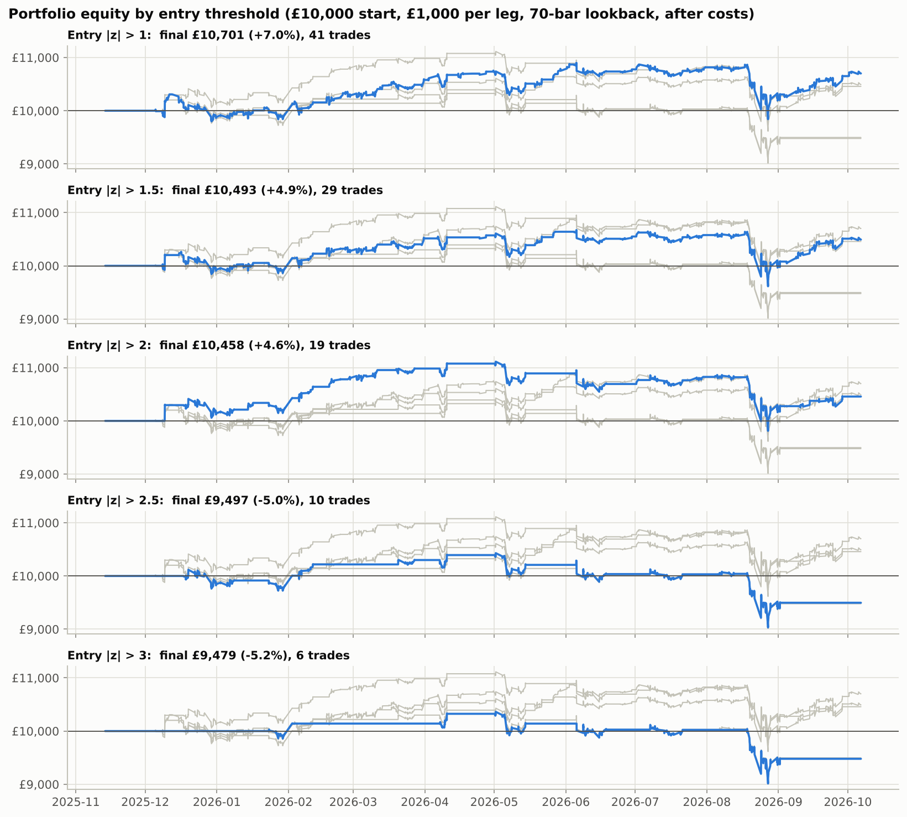
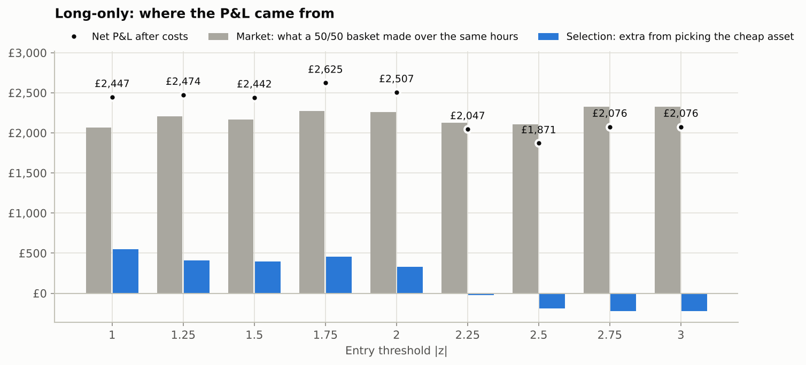
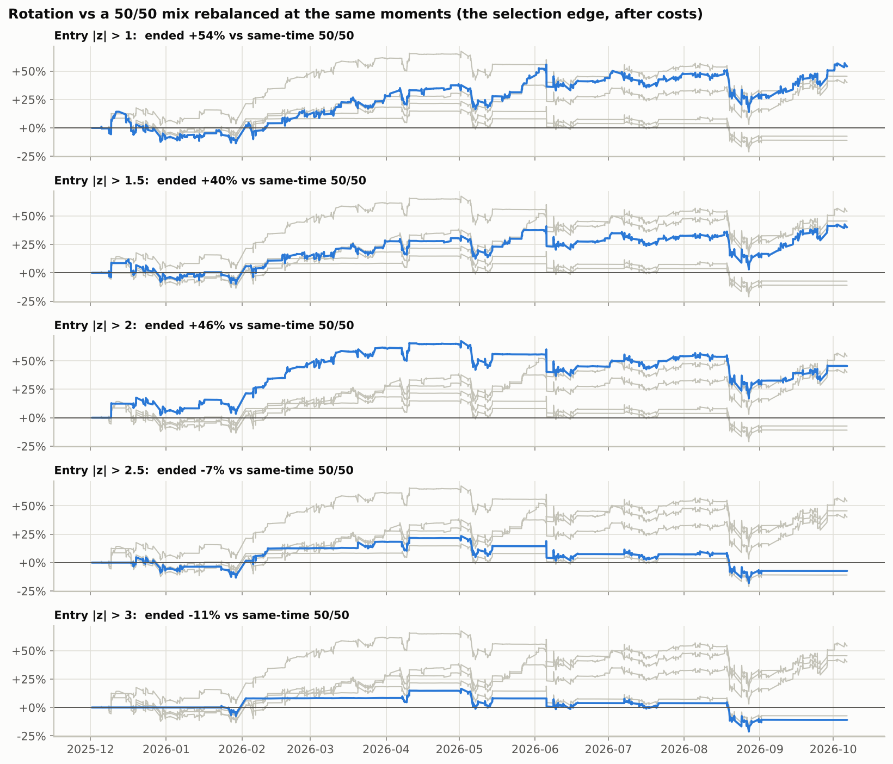

# CYPH vs ZEC pairs-trading backtest

An hourly z-score mean-reversion backtest of **Cypherpunk Technologies (Nasdaq: CYPH)** against **Zcash (ZEC)**.
The test starts with a £10,000 portfolio, puts £1,000 on each leg of every trade, and compares a range of entry
thresholds. Two variants use the same signal without shorting: a
[long-only version](#long-only-variant-just-buy-whichever-asset-is-cheap) that buys whichever asset is cheap, and a
[rotation](#rotation-variant-always-hold-the-pair-tilt-into-the-cheap-one) that always holds the pair and tilts into
the cheap one. A [shuffled-history test](#is-any-of-it-better-than-chance) checks whether any of it beats luck.

The full auto-generated report, with every table and chart, is in **[results/REPORT.md](results/REPORT.md)**.

## Recommended strategy

Of every version tested, the best was the **50/50 rotation** with a 70-hour lookback, entry ±1.5 and a stop at ±3.0:

* hold 50% CYPH / 50% ZEC by default;
* move to 100% CYPH when z < −1.5 (CYPH cheap), or to 100% ZEC when z > +1.5 (ZEC cheap);
* go back to 50/50 when z crosses 0, or if z reaches ±3.0 (stop-loss).

From 1 Dec 2025 to 6 Oct 2026, £1,000 grew to **£5,415** (+442%, worst drawdown −58%). That compares with
£3,861 for holding ZEC, £3,197 for holding 50/50, £2,053 for the hedged pairs trade and £1,988 for long-only, all
after costs. Entry ±1.5 sits in the middle of the range of settings that worked, and it was positive at every
lookback tested, rather than being the single best cell.

It is **not statistically proven**: shuffled histories matched it 8% of the time (14% with day shuffles). A
walk-forward test also shows that settings picked on the first half of the year added little in the second half. See
[Is any of it better than chance?](#is-any-of-it-better-than-chance).

`python make_dashboard.py` builds `results/dashboard.html`, an interactive page with the equity curves, comparison
table, robustness grid and walk-forward test.

## The strategy

* **Spread** = ln(CYPH) − ln(ZEC): CYPH's price relative to ZEC.
* **Z-score** = (spread − rolling mean) / rolling standard deviation over the last 70 hourly bars (about 2 trading
  weeks).
* **z > +threshold**: CYPH is rich relative to ZEC, so **short £1,000 CYPH and buy £1,000 ZEC**.
* **z < −threshold**: CYPH is cheap relative to ZEC, so **buy £1,000 CYPH and short £1,000 ZEC**.
* **Exit** when z returns to 0, meaning the gap has closed back to its recent average.
* One pair position is open at a time. The rest of the £10,000 stays as cash/margin.
* The signal is computed on an hourly close and **filled at the next bar's open**, so there is no look-ahead. A signal
  on the 16:00 close fills at the next morning's 09:30 open.
* Each £1,000 leg is converted to USD at the live GBP/USD rate, and P&L is converted back to GBP.
* **Costs:** 20 bps per side on each leg (fees plus spread/slippage), plus 10% a year financing on whichever leg is
  short. All of these are configurable.

CYPH's daily beta to ZEC over the period is **1.02** (correlation 0.75). Equal £1,000 legs are therefore very close to
beta-neutral, and that is why a plain price ratio, rather than a regression hedge ratio, is used as the spread.

## Results

**Period:** 13 Nov 2025 → 6 Oct 2026, 1,545 hourly bars, data downloaded 7 Oct 2026. Over the same period ZEC rose
166% and CYPH rose 88%. Figures are net of all costs. The H1/H2 column splits P&L by trade entry date at 26 Apr 2026.

### As specified (enter at the threshold, exit at z = 0, no stop-loss)

| Entry \|z\| | Trades | Win rate | Net P&L | Portfolio return | Max drawdown | Sharpe | Worst trade | H1 / H2 P&L |
|---:|---:|---:|---:|---:|---:|---:|---:|---:|
| 1 | 41 | 80% | **£701** | +7.0% | −£1,057 | 0.81 | −£544 | £735 / −£34 |
| 1.25 | 34 | 76% | **£477** | +4.8% | −£1,057 | 0.57 | −£544 | £569 / −£92 |
| 1.5 | 29 | 72% | **£493** | +4.9% | −£1,054 | 0.60 | −£544 | £572 / −£79 |
| 1.75 | 26 | 73% | **£650** | +6.5% | −£1,024 | 0.80 | −£544 | £818 / −£168 |
| 2 | 19 | 68% | **£458** | +4.6% | −£1,301 | 0.58 | −£544 | £1,077 / −£619 |
| 2.25 | 13 | 62% | **−£188** | −1.9% | −£1,397 | −0.20 | −£544 | £708 / −£896 |
| 2.5 | 10 | 50% | **−£503** | −5.0% | −£1,397 | −0.63 | −£544 | £393 / −£896 |
| 2.75 | 6 | 33% | **−£521** | −5.2% | −£1,347 | −0.84 | −£544 | £325 / −£846 |
| 3 | 6 | 33% | **−£521** | −5.2% | −£1,347 | −0.84 | −£544 | £325 / −£846 |

### Same, plus a z-score stop-loss at entry + 1.5

This closes a trade if the gap widens a further 1.5 standard deviations. After a stop, the same side is not
re-entered until z is back inside the entry band.

| Entry \|z\| | Trades | Win rate | Net P&L | Portfolio return | Max drawdown | Sharpe | Worst trade | H1 / H2 P&L |
|---:|---:|---:|---:|---:|---:|---:|---:|---:|
| 1 | 51 | 69% | **£1,122** | +11.2% | −£498 | 1.52 | −£251 | £343 / £779 |
| 1.25 | 40 | 68% | **£1,090** | +10.9% | −£515 | 1.42 | −£231 | £512 / £578 |
| 1.5 | 33 | 64% | **£1,053** | +10.5% | −£499 | 1.42 | −£198 | £497 / £556 |
| 1.75 | 30 | 70% | **£1,117** | +11.2% | −£418 | 1.56 | −£256 | £723 / £394 |
| 2 | 23 | 61% | **£1,041** | +10.4% | −£528 | 1.43 | −£256 | £1,181 / −£139 |
| 2.25 | 15 | 60% | **£51** | +0.5% | −£710 | 0.12 | −£285 | £708 / −£657 |
| 2.5 | 14 | 50% | **−£250** | −2.5% | −£1,026 | −0.33 | −£285 | £393 / −£643 |
| 2.75 | 7 | 43% | **−£713** | −7.1% | −£1,539 | −1.17 | −£544 | £325 / −£1,038 |
| 3 | 7 | 43% | **−£561** | −5.6% | −£1,387 | −0.90 | −£544 | £325 / −£886 |



### Key findings

1. **Lower thresholds (1.0 to 2.0) made money; 2.25 and above lost.** Low thresholds trade more often (41 trades at
   1.0 against 6 at 3.0), and many small reversions add up. The biggest dislocations were mostly real repricings,
   not noise that reverted. For example, from 18 Aug to 1 Sep 2026 CYPH rose 115% while ZEC rose 63%. The
   short-CYPH trade opened at z = 3.8 lost **£544**, the worst trade in the test.
2. **The short-CYPH / long-ZEC side (your example trade) was the weaker side.** It made £484 at a 1.0 threshold, only
   £7 to £100 from 1.25 to 2.0, and lost money above that. Most of the profit came from the opposite trade: buying
   CYPH when it was cheap against ZEC. See `results/charts/04_pnl_by_direction.png`.
3. **Without a stop, the drawdowns are large relative to the position size.** Peak-to-trough drawdowns were about
   £1,000 to £1,400, more than the £1,000 per leg. That's because the rolling mean follows a widening gap, so z
   can come back to 0 after the prices have already moved against the trade.
4. **A simple z stop-loss helped a lot.** With a stop at entry + 1.5, net P&L at thresholds of 1.0 to 2.0 rose from
   £458–£701 to £1,041–£1,122. Max drawdown halved to about £500, and thresholds 1.0 to 1.75 were profitable
   in both halves of the period. Without the stop, every threshold lost money in the second half.
5. **The lookback window matters as much as the threshold.** 35 and 70 bars (1 to 2 weeks) worked, 140 bars was
   marginal, and 280 bars lost money at every threshold. The 280-bar result still holds when every lookback is
   compared over the same window.
6. **Costs are material but don't decide the outcome.** At the default assumptions, costs plus borrow came to £76 to
   £400 per year depending on the threshold. Doubling them still left thresholds 1.0 to 2.0 positive.
7. **None of this is statistically proven.** On shuffled versions of the same history, the same rules did as well as
   the real result 22% to 28% of the time at thresholds 1.0 to 2.0 (7% to 11% with the stop). See
   [Is any of it better than chance?](#is-any-of-it-better-than-chance)

### Caveats

* **Short history.** Yahoo Finance has hourly CYPH bars only from 13 Nov 2025, the day after Leap Therapeutics
  renamed itself Cypherpunk Technologies. Before that, the stock was a roughly $0.45 biotech under the ticker LPTX
  and had nothing to do with ZEC. So the test covers about 11 months, not a full 12.
* **Small samples and in-sample selection.** 6 to 51 trades per setting is not many. The "best" threshold, lookback
  and stop were all found on the same data they are scored on, so treat the ranking as indicative and confirm it on
  new data before trading.
* **Regime risk.** CYPH is a ZEC-treasury company, so its premium to its ZEC holdings can reprice sharply on
  financing news. On 5 Jun 2026 CYPH fell 47% in one day while ZEC fell 36%. A stop-loss does not protect against
  overnight gaps.
* **Implementation.** Borrow on a small-cap like CYPH may be unavailable or cost far more than 10% a year. Shorting
  ZEC needs margin or perpetual futures. Under FCA rules, crypto derivatives can't be sold to UK retail clients, so
  the long-CYPH / short-ZEC side (where most of the profit came from) may not be possible from a UK retail account.
  Check what your broker or exchange allows.
* **Data quirks.** Yahoo has no CYPH bars from 30 Jan 11:30 to 2 Feb 12:30 ET (2026). A few bars report zero volume;
  they are kept because their prices are valid. Yahoo's 16:00 and half-day 13:00 snapshot bars are dropped.

## Long-only variant: just buy whichever asset is cheap

`python run_long_only.py` writes **[results/long_only/REPORT.md](results/long_only/REPORT.md)**.

This uses the same signal with no short leg. When z < −threshold, CYPH is cheap relative to ZEC, so it buys £1,000 of
CYPH. When z > +threshold, ZEC is cheap relative to CYPH, so it buys £1,000 of ZEC. It sells when z returns to 0 and
holds cash otherwise. With no short, there is no borrow cost and nothing that needs crypto derivatives.

### How it can count as a relative-value trade

Buying £1,000 of the cheap asset is exactly the same position as:

1. **£500 of each asset (the "market part").** This is the direction of the whole Zcash trade. You would earn it
   holding either asset, and it says nothing about the signal.
2. **£500 long the cheap asset and £500 short the rich one (the "selection part").** This is a half-size version of
   the pairs trade above, and it is the only part that tests the "cheap vs rich" idea.

So the long-only version only qualifies as relative value if the **selection part** is positive and better than
chance. It is checked three ways:

* **Shuffled-history test** (see [below](#is-any-of-it-better-than-chance)): rerun the rules on hundreds of versions
  of the past year with the CYPH/ZEC moves put in random order, so there is no mean reversion to find.
* **Random-timing test:** keep each trade's length but start it at a random hour.
* **Buy & hold:** compare against £1,000 in ZEC, CYPH or 50/50, held from the first possible signal on 1 Dec 2025.

### Results (70-bar lookback, exit at z = 0, after costs)

| Entry \|z\| | Trades | Net P&L | Market part | Selection part | Selection p (hours / days) | Random-timing p | Max drawdown |
|---:|---:|---:|---:|---:|---:|---:|---:|
| 1 | 41 | **£2,447** | £2,066 | £551 | 0.22 / 0.40 | 0.30 | −£829 |
| 1.5 | 29 | **£2,442** | £2,169 | £394 | 0.27 / 0.42 | 0.22 | −£703 |
| 2 | 19 | **£2,507** | £2,258 | £330 | 0.28 / 0.44 | 0.10 | −£518 |
| 2.5 | 10 | **£1,871** | £2,107 | −£192 | 0.68 / 0.83 | 0.06 | −£477 |
| 3 | 6 | **£2,076** | £2,327 | −£222 | 0.81 / 0.87 | 0.01 | −£224 |
| _Buy & hold ZEC_ | 1 | **£2,866** | | | | | −£1,006 |
| _Buy & hold 50/50_ | 1 | **£2,201** | | | | | −£880 |
| _Buy & hold CYPH_ | 1 | **£1,536** | | | | | −£926 |

Net P&L = market part + selection part − costs. A p-value is the share of random trials that did at least as well,
so lower is better and below about 0.05 would suggest skill. "Hours / days" are the two shuffle styles explained
[below](#is-any-of-it-better-than-chance).



### What it shows

1. **Long-only made far more money than the pairs trade (+19% to +26% on the £10,000), but mostly from the market
   rising.** At thresholds 1.0 to 2.0, 79% to 87% of the gross P&L was the market part. Buying the *rich* asset
   on every signal instead would still have made £1,350 to £2,520.
2. **The selection part is the pairs trade's edge, halved.** At thresholds 1.0 to 2.0 it was +£330 to +£551, exactly
   half the hedged trade's gross P&L. Shuffled histories matched it 22% to 28% of the time (hour shuffles), so it
   isn't distinguishable from luck.
3. **It beat holding 50/50, but not holding ZEC.** At thresholds 1.0 to 2.0 it made £240 to £420 more than holding
   50/50, while invested only 46% to 70% of the time and with smaller drawdowns. Simply holding ZEC made more
   (£2,866).
4. **With the stop-loss (entry + 1.5), the selection part grows to +£631 to +£787,** matching the improvement the
   stop gave the pairs trade. Shuffled histories still matched it 7% to 11% of the time (hours) or 13% to 19%
   (days), so it falls short of the 5% bar. (An earlier version of this README said it passed a "coin-flip" test
   at p 0.01 to 0.02. That test turned out to be too generous and has been replaced; see
   [below](#is-any-of-it-better-than-chance).) Total P&L also falls to £758 to £1,283, because the stops took it out
   of the market during the big rallies.
5. **At the high thresholds (2.75 to 3.0), selection was negative but the timing looked good (p ≈ 0.01).** Four of
   the five "buy CYPH" signals came right after sharp sell-offs in both assets (April, May and June 2026), and both
   then rose roughly 35% to 60%. That's a "buy after a crash" effect, not relative value, and it rests on 6 trades.
   With this many thresholds and variants tested, an occasional p ≈ 0.01 is expected by chance.

**Bottom line:** the long-only version's relative-value content is just the pairs trade at half size: positive
in this sample, but not distinguishable from luck. The rest of the P&L is a bet on the Zcash complex going up. If you
want that exposure anyway, a fairer way to use the signal is as a rule for *which* of the two to hold, judged against
a 50/50 holding. That is the rotation below.

## Rotation variant: always hold the pair, tilt into the cheap one

`python run_rotation.py` writes **[results/rotation/REPORT.md](results/rotation/REPORT.md)**.

A £1,000 sleeve is always fully invested in the two assets:

| Signal (same z-score, 70-bar lookback) | Holding |
|---|---|
| default | 50% CYPH / 50% ZEC |
| z < −threshold (CYPH cheap vs ZEC) | 100% CYPH |
| z > +threshold (ZEC cheap vs CYPH) | 100% ZEC |
| z back through 0 (or the stop-loss) | back to 50% / 50% |

Rebalances fill at the next hour's open, with 20 bps per side. There is no shorting and no borrow, and gains stay
invested. `--tilt 0.75` would use a 75/25 tilt instead of 100/0, and `--sleeve` changes the size.

**Why this is the fair test of "cheap vs rich":** the sleeve is always 100% in the Zcash complex, so the market's
direction hits it about the same as holding 50/50. The comparison that isolates the signal is a **50/50 mix
rebalanced at the same moments**. Any gap between the two comes only from which asset was overweighted, minus the
extra costs.

### Results (first signal 1 Dec 2025 → 6 Oct 2026, after costs)

| Entry \|z\| | Tilts (CYPH / ZEC) | P&L on £1,000 | Ahead of same-time 50/50 | 1st half / 2nd half | Max drawdown | p (hours / days) |
|---:|---:|---:|---:|---:|---:|---:|
| 1 | 21 / 20 | **£4,229** (+423%) | +54% | +33% / +16% | −64% | 0.13 / 0.34 |
| 1.5 | 17 / 12 | **£3,706** (+371%) | +40% | +27% / +11% | −59% | 0.17 / 0.36 |
| 2 | 11 / 8 | **£3,996** (+400%) | +46% | +65% / −12% | −60% | 0.15 / 0.32 |
| 2.5 | 6 / 4 | **£2,097** (+210%) | −7% | +22% / −24% | −60% | 0.52 / 0.71 |
| 3 | 5 / 1 | **£1,967** (+197%) | −11% | +15% / −22% | −59% | 0.70 / 0.79 |
| _with stop-loss at entry + 1.5:_ | | | | | | |
| 1 | 29 / 22 | **£4,418** (+442%) | +55% | +6% / +47% | −67% | 0.08 / 0.15 |
| 1.5 | 20 / 13 | **£4,415** (+442%) | +60% | +22% / +31% | −58% | 0.08 / 0.14 |
| 2 | 14 / 9 | **£4,869** (+487%) | +68% | +73% / −3% | −58% | 0.06 / 0.16 |
| _Buy & hold 50/50_ | | **£2,197** (+220%) | | | −60% | |
| _Buy & hold ZEC_ | | **£2,861** (+286%) | | | −62% | |
| _Buy & hold CYPH_ | | **£1,533** (+153%) | | | −68% | |



### What it shows

1. **This is the best-looking version.** At thresholds 1.0 to 2.0 the £1,000 sleeve grew to £4,700 to £5,250 (P&L
   £3,700 to £4,250). That beat holding 50/50 (£2,197) and holding ZEC outright (£2,861), and it ended 40% to 55%
   wealthier than the same-time 50/50.
2. **Why it's so much bigger than the long-only selection part:** it's the same half-size pairs edge, but applied to
   the whole sleeve, with no borrow cost, and compounding. Gains made early stayed invested while the Zcash complex
   roughly tripled.
3. **It is not safer.** It is always fully invested in two very volatile assets. Drawdowns were 55% to 67% of the
   sleeve, about the same as holding 50/50 (−60%).
4. **The same pattern as before:** thresholds 1.0 to 1.75 were ahead in both halves of the period, 2.0 gave back some
   of its lead in the second half, 2.25 finished only slightly ahead (+8%), and 2.5 and above lagged 50/50. The stop-loss helped again (+55% to +73%).
5. **Still not proven.** Shuffled histories matched the result 13% to 17% of the time without a stop (hour shuffles)
   and 6% to 8% with one. That's closer to the bar than the other versions, but it still doesn't reach 5%. With
   day shuffles it's 27% to 41% and 11% to 16%.

## Is any of it better than chance?

The CYPH/ZEC gap is extremely volatile, so luck can produce large results on its own. To measure that, the
**shuffled-history test** keeps ZEC's real price path but rebuilds CYPH from the real hour-by-hour moves of the gap
between them, put in a random order. The fake histories have exactly the same size of moves (and even end at the
same place), but any mean reversion is gone. Every strategy is rerun on 300 of them. The p-value is the share of
shuffles where it did at least as well as on the real history.

* **Hour shuffles** randomise every hourly move. On these, the same rules typically *lose*: the median pairs result
  is −£185 to −£343, and the median rotation finishes 10% to 17% behind 50/50.
* **Day shuffles** randomise whole days but keep each day's hours in order. On these, the pairs trade still makes a
  median of about +£340, against £458 to £701 on the real history. So a good part of the apparent edge is ordinary
  intraday reversal in hourly prices, not the multi-day mean reversion the strategy is designed around. Some of that
  could be CYPH's bid/ask bounce, which you may not be able to capture in practice.

| Entry \|z\| (no stop / with stop) | Pairs trade net P&L | p (hours) | Rotation vs same-time 50/50 | p (hours) |
|---:|---:|---:|---:|---:|
| 1 | £701 / £1,122 | 0.22 / 0.07 | +54% / +55% | 0.13 / 0.08 |
| 1.5 | £493 / £1,053 | 0.28 / 0.10 | +40% / +60% | 0.17 / 0.08 |
| 2 | £458 / £1,041 | 0.28 / 0.11 | +46% / +68% | 0.15 / 0.06 |

**None of the three versions clears the usual 5% bar.** The closest are the stop-loss variants at p 0.06 to 0.11, and
those were picked after looking at several variants, which makes them look better than they are. The honest summary
is that the past year is *consistent with* a modest mean-reversion edge at low thresholds, but one year of this pair
is not enough to tell it apart from luck.

**A correction:** the long-only analysis first used a "coin-flip" test (keep the trade times, pick the asset at
random). On random-walk histories with no edge, that test reported p < 0.05 about 14% of the time instead of 5%,
because the exits depend on the price path. It has been replaced by the shuffled-history test everywhere.

## Running it

```bash
pip install -r requirements.txt
python run_backtest.py                 # uses the cached data in data/
python run_backtest.py --refresh       # re-downloads the latest year first
python run_backtest.py --leg-notional 500 --cost-bps-cyph 30 --borrow-cyph 0.25 --lookback 35
python run_long_only.py                # long-only "buy the cheap one" variant
python run_rotation.py                 # rotation variant + shuffled-history significance test (~1 minute)
python make_dashboard.py               # interactive results page (run run_rotation.py first)
python -m pytest                       # engine tests (look-ahead, sizing, costs, stops, attribution)
```

`python run_backtest.py --help` lists every option. Each run rewrites `results/`.

## How it's built

| Path | What it does |
|---|---|
| `pairs_backtest/data.py` | Downloads CYPH and GBP/USD hourly bars (Yahoo Finance) and ZEC-USD 15-minute candles (Coinbase), caches them as CSV, and aligns them. ZEC is priced at the exact open and close time of each CYPH bar. CYPH bars run from :30 to :30, so 15-minute ZEC candles avoid a 30-minute mismatch. |
| `pairs_backtest/engine.py` | Bar-by-bar backtest: z-score, entries/exits, next-bar-open fills, whole-share sizing for CYPH, fees, borrow, FX and mark-to-market equity. |
| `pairs_backtest/attribution.py` | Splits long-only P&L into market and selection parts; random-timing test and buy & hold benchmarks. |
| `pairs_backtest/rotation.py` | Always-invested rotation simulator (vectorised, so many paths can run at once). |
| `pairs_backtest/placebo.py` | Shuffled-history significance test, run in parallel. |
| `pairs_backtest/metrics.py` | Trade and portfolio statistics, plus pair diagnostics (correlation, beta, Dickey-Fuller, half-life). |
| `pairs_backtest/report.py` | Charts. |
| `run_backtest.py` | Runs the threshold grid, lookback grid, robustness variants and half-period split, then writes `results/`. |
| `run_long_only.py` | Runs the long-only variant with attribution and benchmarks, then writes `results/long_only/`. |
| `make_dashboard.py`, `dashboard/template.html` | Builds `results/dashboard.html`: recommended strategy, equity curves vs alternatives, robustness grid, walk-forward test. |
| `run_rotation.py` | Runs the rotation variant and the shuffled-history test for all three versions, then writes `results/rotation/`. |
| `data/` | Cached raw data: `cyph_1h.csv`, `zec_15m.csv`, `gbpusd_1h.csv`. |
| `results/` | `REPORT.md`, charts, per-threshold summaries, every trade (`trades_headline.csv`) and hourly equity curves. |
| `tests/` | Unit tests for the engine on synthetic data. |
