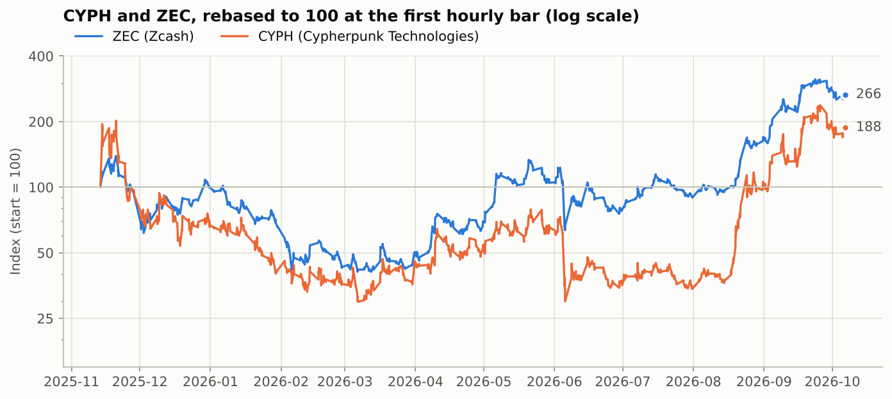
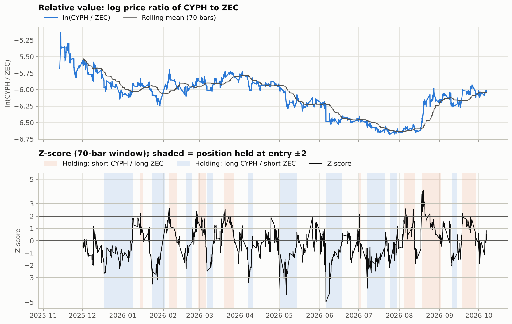
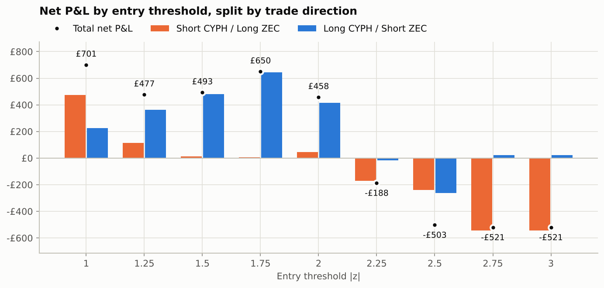
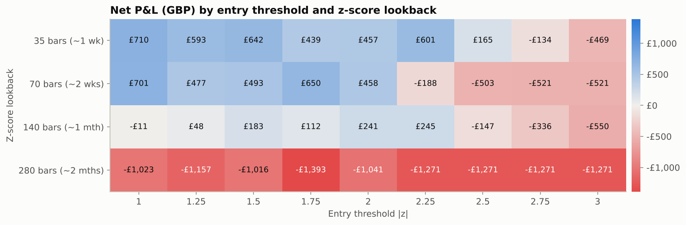

# CYPH vs ZEC z-score pairs trade: backtest report

_Generated by `run_backtest.py`. All P&L is in GBP and **after** trading costs and short financing unless stated._

## Setup

| | |
|---|---|
| Pair | **CYPH** (Cypherpunk Technologies, Nasdaq) vs **ZEC** (Zcash, Coinbase ZEC-USD) |
| Period | 13 Nov 2025 15:30 ET → 06 Oct 2026 16:00 ET (1,545 hourly bars) |
| Bar size | 1 hour, CYPH regular session (09:30-16:00 ET); ZEC priced at the same instants |
| Spread | ln(CYPH) − ln(ZEC) (CYPH's price relative to ZEC) |
| Z-score | (spread − rolling mean) / rolling std, **70-bar** lookback (~10 trading days) |
| Entry | z > +threshold → **short CYPH / long ZEC**; z < −threshold → **long CYPH / short ZEC** |
| Exit | z crosses back through 0 (convergence); open trades closed at the end of the test |
| Warm-up | first signal possible at 01 Dec 2025 12:30 ET, once 70 bars of history exist |
| Execution | signal on the bar close, filled at the **next bar's open** (no look-ahead) |
| Capital | £10,000 portfolio, **£1,000 per leg** (£1,000 long + £1,000 short, dollar-neutral), one pair position at a time |
| Costs | 20 bps per side on CYPH, 20 bps per side on ZEC (fees + spread/slippage) |
| Short financing | 10% p.a. when short CYPH (stock borrow), 10% p.a. when short ZEC |
| FX | positions sized and P&L converted at the live GBPUSD rate |

## Pair diagnostics

| | |
|---|---|
| CYPH return over period | +88% |
| ZEC return over period | +166% |
| Correlation of hourly returns | 0.62 |
| Correlation of daily returns | 0.75 |
| Daily beta of CYPH to ZEC | 1.02 |
| Dickey-Fuller t-stat on ln(CYPH/ZEC) | -2.43 (5% critical value ≈ −2.86; 10% ≈ −2.57) |
| Mean-reversion half-life of the spread | 99 hourly bars (~14 trading days) |

A beta close to 1 means equal-sized legs are close to beta-neutral. The Dickey-Fuller statistic is above the 5% critical value, so over the full window the ratio is **not** statistically proven to mean-revert. That is why a rolling z-score (which follows a drifting mean) is used rather than a fixed long-run mean.

## Headline results (70-bar lookback, exit at z = 0)

| Entry \|z\| | Trades | Win rate | Net P&L | Portfolio return | Return on £1,000 leg | Avg trade | Worst trade | Profit factor | Max drawdown | Sharpe | Avg hold | In market | Costs + borrow |
|---:|---:|---:|---:|---:|---:|---:|---:|---:|---:|---:|---:|---:|---:|
| 1 | 41 | 80% | £701 | +7.0% | +70% | £17 | -£544 | 1.50 | -£1,057 (-9.7%) | 0.81 | 5.7 days | 70% | £400 |
| 1.25 | 34 | 76% | £477 | +4.8% | +48% | £14 | -£544 | 1.38 | -£1,057 (-9.9%) | 0.57 | 6.3 days | 66% | £339 |
| 1.5 | 29 | 72% | £493 | +4.9% | +49% | £17 | -£544 | 1.42 | -£1,054 (-9.9%) | 0.60 | 6.8 days | 61% | £295 |
| 1.75 | 26 | 73% | £650 | +6.5% | +65% | £25 | -£544 | 1.62 | -£1,024 (-9.2%) | 0.80 | 7.0 days | 57% | £267 |
| 2 | 19 | 68% | £458 | +4.6% | +46% | £24 | -£544 | 1.45 | -£1,301 (-11.7%) | 0.58 | 7.9 days | 46% | £202 |
| 2.25 | 13 | 62% | -£188 | -1.9% | -19% | -£14 | -£544 | 0.81 | -£1,397 (-13.0%) | -0.20 | 9.4 days | 38% | £146 |
| 2.5 | 10 | 50% | -£503 | -5.0% | -50% | -£50 | -£544 | 0.49 | -£1,397 (-13.4%) | -0.63 | 10.9 days | 34% | £118 |
| 2.75 | 6 | 33% | -£521 | -5.2% | -52% | -£87 | -£544 | 0.38 | -£1,347 (-13.0%) | -0.84 | 11.2 days | 21% | £76 |
| 3 | 6 | 33% | -£521 | -5.2% | -52% | -£87 | -£544 | 0.38 | -£1,347 (-13.0%) | -0.84 | 11.2 days | 21% | £76 |

"Return on £1,000 leg" is net P&L divided by the £1,000 committed per leg. "Portfolio return" is on the full
£10,000. Sharpe uses daily equity changes, annualised with √252.

Best threshold in this run: **|z| > 1**, net £701 from 41 trades
(+7.0% on the portfolio).

## Sensitivity to the z-score lookback

Net P&L for every combination of lookback window and entry threshold (other settings as headline).
Longer windows need more history before the first signal, so they start trading later
(35 bars: 20 Nov 2025, 70 bars: 01 Dec 2025, 140 bars: 15 Dec 2025, 280 bars: 14 Jan 2026).

| Lookback | z 1 | z 1.25 | z 1.5 | z 1.75 | z 2 | z 2.25 | z 2.5 | z 2.75 | z 3 |
|---:|---:|---:|---:|---:|---:|---:|---:|---:|---:|
| 35 bars | £710 | £593 | £642 | £439 | £457 | £601 | £165 | -£134 | -£469 |
| 70 bars | £701 | £477 | £493 | £650 | £458 | -£188 | -£503 | -£521 | -£521 |
| 140 bars | -£11 | £48 | £183 | £112 | £241 | £245 | -£147 | -£336 | -£550 |
| 280 bars | -£1,023 | -£1,157 | -£1,016 | -£1,393 | -£1,041 | -£1,271 | -£1,271 | -£1,271 | -£1,271 |

## Robustness checks (70-bar lookback, net P&L)

* **Zero costs / Double costs**: no fees, slippage or borrow; or twice the headline assumptions.
* **Exit at |z| 0.5**: take profit before full convergence.
* **Stop at entry+1.5**: close if the gap widens a further 1.5 standard deviations (no re-entry on that side until z
  is back inside the entry band).
* **5-day time stop**: close any trade still open after 35 hourly bars.
* **Short-CYPH side only**: only take the "CYPH rich vs ZEC" trade from your example (short CYPH, long ZEC).

| Entry \|z\| | Headline | Zero costs | Double costs | Exit at \|z\| 0.5 | Stop at entry+1.5 | 5-day time stop | Short-CYPH side only |
|---:|---:|---:|---:|---:|---:|---:|---:|
| 1 | £701 | £1,101 | £301 | £122 | £1,122 | £185 | £484 |
| 1.25 | £477 | £816 | £138 | £97 | £1,090 | £402 | £100 |
| 1.5 | £493 | £788 | £198 | £189 | £1,053 | £232 | £12 |
| 1.75 | £650 | £917 | £383 | £376 | £1,117 | -£80 | £7 |
| 2 | £458 | £660 | £256 | £432 | £1,041 | -£123 | £44 |
| 2.25 | -£188 | -£42 | -£334 | £59 | £51 | -£554 | -£170 |
| 2.5 | -£503 | -£385 | -£621 | -£314 | -£250 | -£867 | -£240 |
| 2.75 | -£521 | -£445 | -£597 | -£630 | -£713 | -£814 | -£544 |
| 3 | -£521 | -£445 | -£597 | -£630 | -£561 | -£814 | -£544 |

## Stability across the two halves of the period

Headline trades split by entry date at 26 Apr 2026.

| Entry \|z\| | 1st half trades | 1st half P&L | 2nd half trades | 2nd half P&L |
|---:|---:|---:|---:|---:|
| 1 | 18 | £735 | 23 | -£34 |
| 1.25 | 14 | £569 | 20 | -£92 |
| 1.5 | 12 | £572 | 17 | -£79 |
| 1.75 | 11 | £818 | 15 | -£168 |
| 2 | 10 | £1,077 | 9 | -£619 |
| 2.25 | 8 | £708 | 5 | -£896 |
| 2.5 | 5 | £393 | 5 | -£896 |
| 2.75 | 2 | £325 | 4 | -£846 |
| 3 | 2 | £325 | 4 | -£846 |

## Files

* `summary_headline.csv`: every metric for each threshold (headline settings)
* `trades_headline.csv`: every trade for each threshold, with entry/exit prices, sizes, costs and P&L
* `equity_headline.csv`: hourly equity curve for each threshold
* `grid_lookback_threshold.csv`, `robustness.csv`, `stability_halves.csv`: the sensitivity tables above
