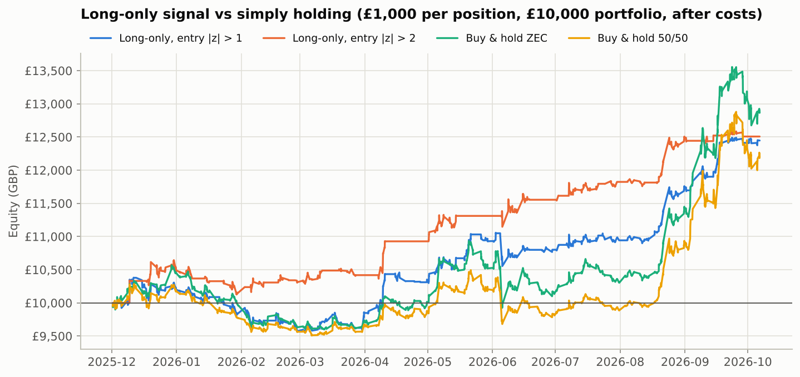
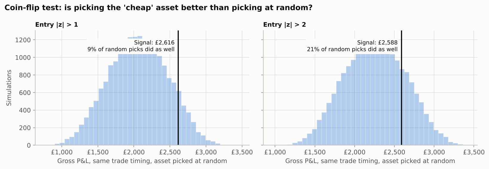

# Long-only "buy the cheap one": backtest report

_Generated by `run_long_only.py`. All P&L is in GBP, after trading costs._

## What "cheap" means here

The signal is the same one the pairs trade uses: the z-score of ln(CYPH / ZEC) against its last 70
hourly bars.

* **z < −threshold**: CYPH is cheap relative to ZEC, so **buy £1,000 of CYPH**.
* **z > +threshold**: ZEC is cheap relative to CYPH, so **buy £1,000 of ZEC**.
* **Exit** when z returns to 0. Otherwise hold cash. There is no short leg, so there is no borrow cost.

"Cheap" here is purely *relative*. Both assets can be falling while one is cheap against the other.

## How to judge it

Buying £1,000 of the cheap asset is the same position as:

1. **£500 in each asset** (a 50/50 basket). This is the **market part**: the direction of the whole Zcash trade,
   which you would have earned by holding either asset.
2. **£500 long the cheap asset and £500 short the rich one** (a half-size pairs trade). This is the
   **selection part**, the only part that reflects the cheap/rich signal.

So a long-only result only "qualifies" as relative value if the **selection part** is positive and
better than chance. A big total P&L in a rising market proves nothing on its own. Three checks are used:

* **Coin-flip test:** keep every trade's timing but pick the asset at random, 20,000 times. The p-value is the share
  of random picks that did at least as well as the signal. Below ~0.05 would suggest real skill.
* **Random-timing test:** keep every trade's length but start it at a random hour. This checks whether the market
  part came from good timing or just from being invested while prices rose.
* **Buy & hold benchmarks:** £1,000 held in CYPH, ZEC or 50/50 from 01 Dec 2025
  (the first possible signal) to the end.

## Results (70-bar lookback, exit at z = 0, no stop-loss)

Period: 01 Dec 2025 → 06 Oct 2026. Each position is £1,000 in a
£10,000 portfolio, with 20 bps per side on CYPH and
20 bps per side on ZEC.

| Entry \|z\| | Trades | Win rate | Net P&L | Portfolio return | Max drawdown | Sharpe | In market | Buy CYPH: trades / P&L | Buy ZEC: trades / P&L | H1 / H2 P&L |
|---:|---:|---:|---:|---:|---:|---:|---:|---:|---:|---:|
| 1 | 41 | 54% | £2,447 | +24.5% | -£829 | 2.07 | 70% | 21 / £1,879 | 20 / £569 | £311 / £2,136 |
| 1.25 | 34 | 50% | £2,474 | +24.7% | -£665 | 2.11 | 66% | 19 / £1,926 | 15 / £549 | £493 / £1,982 |
| 1.5 | 29 | 52% | £2,442 | +24.4% | -£703 | 2.08 | 61% | 17 / £2,005 | 12 / £437 | £403 / £2,039 |
| 1.75 | 26 | 54% | £2,625 | +26.2% | -£530 | 2.45 | 57% | 16 / £2,322 | 10 / £303 | £557 / £2,068 |
| 2 | 19 | 74% | £2,507 | +25.1% | -£518 | 2.57 | 46% | 11 / £1,865 | 8 / £642 | £928 / £1,580 |
| 2.25 | 13 | 77% | £2,047 | +20.5% | -£477 | 2.24 | 38% | 8 / £1,440 | 5 / £607 | £637 / £1,410 |
| 2.5 | 10 | 70% | £1,871 | +18.7% | -£477 | 2.09 | 34% | 6 / £1,282 | 4 / £589 | £462 / £1,410 |
| 2.75 | 6 | 83% | £2,076 | +20.8% | -£224 | 2.75 | 21% | 5 / £1,447 | 1 / £630 | £516 / £1,560 |
| 3 | 6 | 83% | £2,076 | +20.8% | -£224 | 2.75 | 21% | 5 / £1,447 | 1 / £630 | £516 / £1,560 |

### Benchmarks over the same window

| Benchmark (£1,000, held throughout) | Net P&L | Max drawdown | Sharpe | In market |
|---:|---:|---:|---:|---:|
| Buy & hold CYPH | £1,536 | -£926 | 1.11 | 100% |
| Buy & hold ZEC | £2,866 | -£1,006 | 1.82 | 100% |
| Buy & hold 50/50 | £2,201 | -£880 | 1.59 | 100% |

## Where the P&L came from

Net P&L = market part + selection part − costs. "If you'd bought the rich asset" re-runs every trade with the
*other* asset over the same hours.

| Entry \|z\| | Net P&L | = Market part | + Selection part | − Costs | Selection share of gross | If you'd bought the rich asset | Coin-flip p | Random-timing p |
|---:|---:|---:|---:|---:|---:|---:|---:|---:|
| 1 | £2,447 | £2,066 | £551 | £169 | 21% | £1,346 | 0.09 | 0.30 |
| 1.25 | £2,474 | £2,208 | £408 | £141 | 16% | £1,658 | 0.16 | 0.24 |
| 1.5 | £2,442 | £2,169 | £394 | £121 | 15% | £1,653 | 0.16 | 0.22 |
| 1.75 | £2,625 | £2,275 | £459 | £109 | 17% | £1,707 | 0.13 | 0.15 |
| 2 | £2,507 | £2,258 | £330 | £81 | 13% | £1,847 | 0.21 | 0.10 |
| 2.25 | £2,047 | £2,124 | -£21 | £56 | -1% | £2,088 | 0.52 | 0.07 |
| 2.5 | £1,871 | £2,107 | -£192 | £44 | -10% | £2,255 | 0.68 | 0.06 |
| 2.75 | £2,076 | £2,327 | -£222 | £28 | -11% | £2,521 | 0.70 | 0.01 |
| 3 | £2,076 | £2,327 | -£222 | £28 | -11% | £2,521 | 0.70 | 0.01 |

### Same, with a z stop-loss at entry + 1.5

| Entry \|z\| | Net P&L | = Market part | + Selection part | − Costs | Selection share of gross | If you'd bought the rich asset | Coin-flip p | Random-timing p |
|---:|---:|---:|---:|---:|---:|---:|---:|---:|
| 1 | £758 | £176 | £787 | £206 | 82% | -£817 | 0.01 | 0.82 |
| 1.25 | £976 | £408 | £731 | £162 | 64% | -£485 | 0.01 | 0.77 |
| 1.5 | £988 | £439 | £683 | £134 | 61% | -£378 | 0.01 | 0.74 |
| 1.75 | £803 | £225 | £700 | £122 | 76% | -£597 | 0.01 | 0.79 |
| 2 | £1,283 | £746 | £632 | £95 | 46% | £19 | 0.02 | 0.52 |
| 2.25 | £935 | £896 | £101 | £62 | 10% | £733 | 0.36 | 0.33 |
| 2.5 | £1,428 | £1,539 | -£52 | £59 | -3% | £1,531 | 0.57 | 0.14 |
| 2.75 | £1,867 | £2,215 | -£316 | £32 | -17% | £2,499 | 0.78 | 0.01 |
| 3 | £1,952 | £2,223 | -£239 | £32 | -12% | £2,430 | 0.72 | 0.01 |

## Files

* `summary_long_only.csv`, `summary_long_only_stop.csv`: all metrics per threshold
* `trades_long_only.csv`: every trade with its market/selection split
* `benchmarks.csv`: buy & hold results
