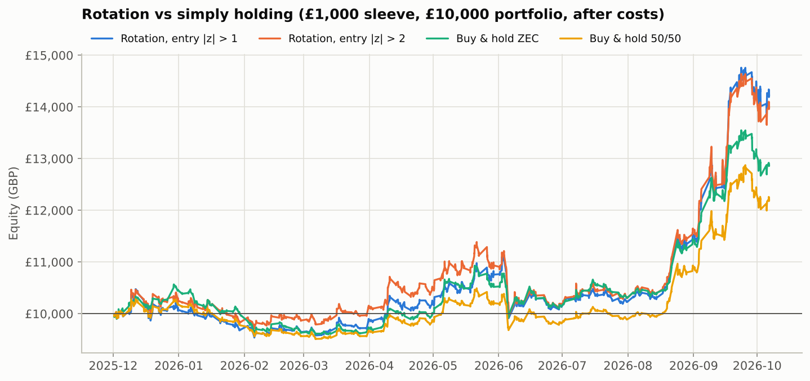
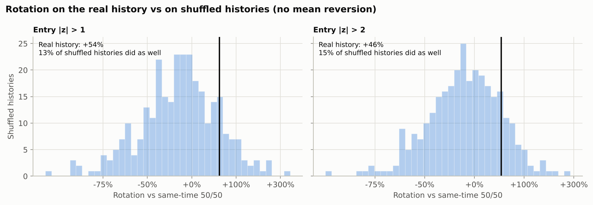

# Rotation ("always hold the pair, tilt into the cheap one"): backtest report

_Generated by `run_rotation.py`. All P&L is in GBP, after trading costs._

## Rules

A £1,000 sleeve is always fully invested in CYPH and ZEC:

| Signal (same z-score as the pairs trade, 70-bar lookback) | Holding |
|---|---|
| default | 50% CYPH / 50% ZEC |
| z < −threshold (CYPH cheap vs ZEC) | 100% CYPH / 0% ZEC |
| z > +threshold (ZEC cheap vs CYPH) | 0% CYPH / 100% ZEC |
| z back through 0 (or the stop-loss, or the end of the test) | back to 50% / 50% |

* Rebalances fill at the next bar's open, with 20 bps per side on CYPH and 20 bps
  per side on ZEC. There is no shorting and no borrow.
* The sleeve compounds: gains stay invested, so later tilts are bigger in £.
* Period: 01 Dec 2025 (first possible signal) → 06 Oct 2026.

## Why this isolates the signal

The sleeve is always 100% invested in the Zcash complex, so the market's direction affects it about as much as
holding 50/50. The fairest comparison is a **50/50 mix rebalanced at the same moments** the rotation trades
("same-time 50/50"). The gap between the two comes only from which asset was overweighted, minus the extra trading
costs. That gap is the selection edge. "Ahead of same-time 50/50" is how much more the rotation ended with, as a
percentage. H1 / H2 splits it at 26 Apr 2026.

## Results (no stop-loss)

| Entry \|z\| | Tilts (CYPH / ZEC) | Time tilted | P&L | Return on sleeve | vs buy & hold 50/50 | Ahead of same-time 50/50 | H1 / H2 | Costs | Max drawdown | Sharpe |
|---:|---:|---:|---:|---:|---:|---:|---:|---:|---:|---:|
| 1 | 21 / 20 | 73% | £4,229 | +423% | £2,033 | +54.2% | +33.4% / +15.6% | £304 | -£1,218 (-64%) | 2.08 |
| 1.25 | 19 / 15 | 69% | £3,703 | +370% | £1,506 | +40.3% | +25.6% / +11.6% | £247 | -£1,081 (-61%) | 2.00 |
| 1.5 | 17 / 12 | 64% | £3,706 | +371% | £1,510 | +40.1% | +26.6% / +10.7% | £213 | -£1,127 (-59%) | 1.99 |
| 1.75 | 16 / 10 | 59% | £4,253 | +425% | £2,057 | +55.1% | +43.4% / +8.2% | £192 | -£1,233 (-57%) | 2.09 |
| 2 | 11 / 8 | 48% | £3,996 | +400% | £1,800 | +45.5% | +65.0% / -11.8% | £135 | -£1,434 (-60%) | 2.06 |
| 2.25 | 8 / 5 | 40% | £2,628 | +263% | £431 | +8.1% | +41.5% / -23.5% | £63 | -£1,194 (-60%) | 1.82 |
| 2.5 | 6 / 4 | 35% | £2,097 | +210% | -£100 | -7.3% | +21.6% / -23.7% | £48 | -£1,021 (-60%) | 1.68 |
| 2.75 | 5 / 1 | 22% | £1,967 | +197% | -£230 | -10.9% | +14.7% / -22.4% | £33 | -£942 (-59%) | 1.66 |
| 3 | 5 / 1 | 22% | £1,967 | +197% | -£230 | -10.9% | +14.7% / -22.4% | £33 | -£942 (-59%) | 1.66 |

## Results with a z stop-loss at entry + 1.5

| Entry \|z\| | Tilts (CYPH / ZEC) | Time tilted | P&L | Return on sleeve | vs buy & hold 50/50 | Ahead of same-time 50/50 | H1 / H2 | Costs | Max drawdown | Sharpe |
|---:|---:|---:|---:|---:|---:|---:|---:|---:|---:|---:|
| 1 | 29 / 22 | 49% | £4,418 | +442% | £2,221 | +54.9% | +5.6% / +46.7% | £338 | -£992 (-67%) | 2.12 |
| 1.25 | 24 / 16 | 58% | £4,407 | +441% | £2,210 | +60.6% | +21.0% / +32.7% | £302 | -£1,101 (-60%) | 2.11 |
| 1.5 | 20 / 13 | 54% | £4,415 | +442% | £2,218 | +59.8% | +22.1% / +30.9% | £251 | -£1,127 (-58%) | 2.11 |
| 1.75 | 19 / 11 | 50% | £4,944 | +494% | £2,748 | +72.5% | +38.5% / +24.6% | £222 | -£1,237 (-55%) | 2.19 |
| 2 | 14 / 9 | 41% | £4,869 | +487% | £2,672 | +67.9% | +72.8% / -2.8% | £171 | -£1,357 (-58%) | 2.19 |
| 2.25 | 10 / 5 | 31% | £2,630 | +263% | £433 | +6.9% | +41.5% / -24.4% | £68 | -£1,117 (-60%) | 1.82 |
| 2.5 | 9 / 5 | 34% | £2,194 | +219% | -£3 | -4.9% | +21.6% / -21.7% | £66 | -£1,013 (-60%) | 1.72 |
| 2.75 | 6 / 1 | 19% | £1,753 | +175% | -£444 | -17.7% | +14.7% / -28.3% | £35 | -£895 (-59%) | 1.60 |
| 3 | 6 / 1 | 21% | £1,918 | +192% | -£279 | -12.8% | +14.7% / -24.0% | £36 | -£942 (-59%) | 1.65 |

### Benchmarks over the same window

| Benchmark (£1,000) | P&L | Return | Max drawdown | Sharpe |
|---:|---:|---:|---:|---:|
| Buy & hold 50/50 | £2,197 | +220% | -£878 (-60%) | 1.72 |
| Buy & hold ZEC | £2,861 | +286% | -£1,004 (-62%) | 1.91 |
| Buy & hold CYPH | £1,533 | +153% | -£924 (-68%) | 1.50 |

## Is any of it better than chance?

The **shuffled-history test** keeps ZEC's real path but rebuilds CYPH from the real hour-by-hour moves of the
CYPH/ZEC gap, put in a random order. The fake histories have the same size of moves and even end at the same
place, but any mean reversion is gone. The same rules are run on each one. The p-value is the share of shuffled
histories where the strategy did at least as well as on the real one. Below about 0.05 would mean the result is
hard to explain by luck. 300 shuffled histories of each kind:

* **p (hours):** every hourly move is shuffled.
* **p (days):** whole days are shuffled, keeping each day's hours in order. This keeps intraday reversal (such as
  bid/ask bounce in CYPH's hourly prices), so it asks whether the strategy does better than that alone.

The long-only version's selection part is exactly half the pairs trade's gross P&L, so its test uses that.

### No stop-loss

| Entry \|z\| | Pairs trade net | p (hours) | p (days) | Long-only selection | p (hours) | p (days) | Rotation vs same-time 50/50 | p (hours) | p (days) |
|---:|---:|---:|---:|---:|---:|---:|---:|---:|---:|
| 1 | £701 | 0.22 | 0.40 | £550 | 0.22 | 0.40 | +54.2% | 0.13 | 0.34 |
| 1.25 | £477 | 0.27 | 0.45 | £408 | 0.27 | 0.45 | +40.3% | 0.17 | 0.41 |
| 1.5 | £493 | 0.28 | 0.43 | £394 | 0.27 | 0.42 | +40.1% | 0.17 | 0.36 |
| 1.75 | £650 | 0.22 | 0.38 | £458 | 0.22 | 0.37 | +55.1% | 0.14 | 0.27 |
| 2 | £458 | 0.28 | 0.43 | £330 | 0.28 | 0.44 | +45.5% | 0.15 | 0.32 |
| 2.25 | -£188 | 0.55 | 0.71 | -£21 | 0.56 | 0.72 | +8.1% | 0.38 | 0.60 |
| 2.5 | -£503 | 0.68 | 0.82 | -£192 | 0.68 | 0.83 | -7.3% | 0.52 | 0.71 |
| 2.75 | -£521 | 0.74 | 0.86 | -£223 | 0.74 | 0.86 | -10.9% | 0.61 | 0.79 |
| 3 | -£521 | 0.80 | 0.87 | -£223 | 0.81 | 0.87 | -10.9% | 0.70 | 0.79 |

### With the stop-loss

| Entry \|z\| | Pairs trade net | p (hours) | p (days) | Long-only selection | p (hours) | p (days) | Rotation vs same-time 50/50 | p (hours) | p (days) |
|---:|---:|---:|---:|---:|---:|---:|---:|---:|---:|
| 1 | £1,122 | 0.07 | 0.13 | £787 | 0.07 | 0.13 | +54.9% | 0.08 | 0.15 |
| 1.25 | £1,090 | 0.09 | 0.12 | £731 | 0.09 | 0.13 | +60.6% | 0.08 | 0.11 |
| 1.5 | £1,053 | 0.10 | 0.15 | £683 | 0.10 | 0.16 | +59.8% | 0.08 | 0.14 |
| 1.75 | £1,117 | 0.11 | 0.16 | £700 | 0.11 | 0.16 | +72.5% | 0.08 | 0.11 |
| 2 | £1,041 | 0.11 | 0.19 | £631 | 0.11 | 0.19 | +67.9% | 0.06 | 0.16 |
| 2.25 | £51 | 0.45 | 0.62 | £101 | 0.47 | 0.63 | +6.9% | 0.34 | 0.57 |
| 2.5 | -£250 | 0.59 | 0.75 | -£52 | 0.59 | 0.75 | -4.9% | 0.51 | 0.69 |
| 2.75 | -£713 | 0.80 | 0.88 | -£316 | 0.80 | 0.89 | -17.7% | 0.68 | 0.84 |
| 3 | -£561 | 0.82 | 0.90 | -£239 | 0.82 | 0.90 | -12.8% | 0.71 | 0.81 |

## Files

* `summary_rotation_none.csv`, `summary_rotation_stop.csv`: all metrics per threshold
* `benchmarks.csv`: buy & hold results
* `significance.csv`: the shuffled-history tables above
